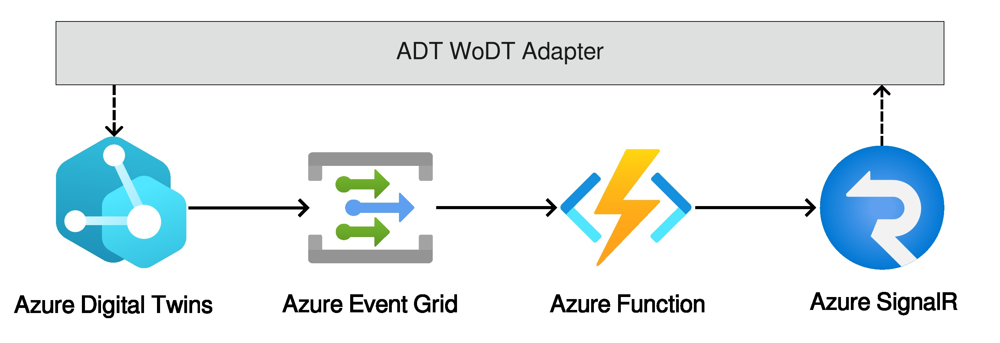

# Major Trauma Management Case Study

[](https://www.apache.org/licenses/LICENSE-2.0)

This repository contains the Digital Twins, the configuration, and a docker compose to run the Major Trauma Management case study using the [Hypermedia-based WoDT Framework](https://github.com/Web-of-Digital-Twins).

We follow the *Major Trauma Management* case study described in [A. Ricci et al. [_Web of Digital Twins_](https://dl.acm.org/doi/10.1145/3507909)]. Trauma management is among the most challenging scenarios in the healthcare context due to its time-dependent nature.
Our objective is to apply the *HWoDT Framework* to the first two stages of the process: the *Emergency Call Management* and the *Pre-Hospital Management*.

## Usage
### Prerequisites
- Make sure you have a running and active version of Docker and docker compose.
- A **running** instance of [Eclipse Ditto](https://eclipse.dev/ditto/)
- The following [Azure](https://learn.microsoft.com/en-us/azure/digital-twins/overview)-based pipeline **running** (click [here](https://github.com/Web-of-Digital-Twins/azuredt-wodt-adapter-azurefunction) for the Azure Function code):

    
    
    - Creation of an Microsoft Entra ID app registration with the Azure Digital Twins Data Owner role -- [Tutorial by Microsoft](https://learn.microsoft.com/en-us/azure/digital-twins/how-to-create-app-registration?tabs=portal).

- *N.B. we had known issues on some versions of Windows, contact the authors if you need help*.

### Steps
1. Clone the repo
2. Create a .env file in the root directory with the following variables:
    - `AZURE_CLIENT_ID`: id of the Microsoft Entra ID app registration.
    - `AZURE_CLIENT_SECRET`: secret of the Microsoft Entra ID app registration.
    - `AZURE_DT_ENDPOINT`: the Azure Digital Twins instance endpoint.
    - `AZURE_TENANT_ID`: the id of the Microsoft Entra ID app registration tenant.
    - `DITTO_OBSERVATION_ENDPOINT`: the WebSocket endpoint to observe the Eclipse Ditto  instance .
    - `DITTO_PASSWORD`: the password of a valid account on the Eclipse Ditto  instance .
    - `DITTO_USERNAME`: the username of a valid account on the Eclipse Ditto  instance .
    - `DITTO_URL`: the url of the Eclipse Ditto instance.
    - `GITHUB_PACKAGES_PASSWORD`: a GitHub token to be able to use the `wldt-wodt-adapter` library -- that it is published on GitHub Packages.
    - `GITHUB_PACKAGES_USERNAME`: the username associated to the previous GitHub token.
    - `SIGNALR_NEGOTIATION_URL`: the url of the Azure SignalR negotiation service.
    - `SIGNALR_TOPIC_NAME`: the topic name used to publish events on Azure SignalR.
3. Run the following command:
    ```bash
      docker-compose up
    ```

## The Major Trauma Management Journey


### Digital Twins involved
#### [White Label Digital Twins Framework](https://wldt.github.io/)
- Mission DT
- Ambulance DT
- Rescuer DT

#### [Azure Digital Twins](https://learn.microsoft.com/en-us/azure/digital-twins/overview)
  - Patient DT
  - Ongoing DT

#### [Eclipse Ditto](https://eclipse.dev/ditto/)
  - Healthcare User DT


### A possible journey
Ambulance, Rescuer, and Healthcare User DT must be registrated manually to the platform. This emulates the integration of healthcare resources from external systems.

1. The CEU receives an emergency call, and a *Mission DT* is created for each mission.
2. The Mission Agent has the responsibility to support the automatic allocation of resources. When it receives the URI of the newly created Mission DT, it performs the following SPARQL query on the system to identify an inactive ambulance and an available rescuer with the Paramedic qualification:
    ```sparql
      PREFIX fhir: <http://www.hl7.org/fhir/>

      SELECT ?ambulance ?rescuer
      WHERE {
          ?ambulance a fhir:Location ;
                      fhir:status "inactive" .

          ?rescuer a fhir:Practitioner ;
                    fhir:qualification ?qualification .
          ?qualification fhir:code ?qualificationObj .
          ?qualificationObj fhir:coding ?qualificationCoding .
          ?qualificationCoding fhir:code ?qualificationCode .
          ?qualificationCode fhir:v "397897005" .

          FILTER NOT EXISTS { ?mission fhir:participant ?rescuer }
          FILTER NOT EXISTS { ?mission fhir:location ?ambulance }
      }
    ```
3. The resources are allocated to the Mission DT by creating relationships with the identified *Ambulance* and *Rescuer DTs*.
4. The Mission Agent controls the ambulance onboard system and sets the new destination to reach. It obtains the Ambulance *Digital Twin Description (DTD)*, fetch and execute the `SetDestinationCommand` action.
5. When the Ambulance reaches the patient a new *Patient DT* is created to track its health status and a relationship with the Mission DT is created.
In the meanwhile, the patient's tax code is used to retrieve -- through the *Platform DT Discovery Service* -- the associated *Healthcare User DT*. If it is found, then a relationship between the two is created.
6. The trauma team is informed about the imminent arrival of a new patient. Therefore, having the Mission DT URI, it can, with a single query on the WoDT Platform, obtain both the interaction patterns to directly observe the Ambulance and the Patient DTs.
    ```sparql
    PREFIX fhir: <http://www.hl7.org/fhir/>
    PREFIX onto: <https://patient.ontology#>
    PREFIX wot: <https://www.w3.org/2019/wot/td#>
    PREFIX hypermedia: <https://www.w3.org/2019/wot/hypermedia#>

    SELECT ?ambulanceEndpoint ?patientEndpoint
    WHERE {
      <#mission>
          fhir:location ?ambulance ;
          onto:patient ?patient .

      ?ambulance wot:hasForm ?ambulanceForm .
      ?ambulanceForm
          hypermedia:hasOperationType wot:observeAllProperties ;
          hypermedia:forSubProtocol "websocket" ;
          hypermedia:hasTarget ?ambulanceEndpoint .

      ?patient wot:hasForm ?patientForm .
      ?patientForm
          hypermedia:hasOperationType wot:observeAllProperties ;
          hypermedia:forSubProtocol "websocket" ;
          hypermedia:hasTarget ?patientEndpoint .
    }
    ```
7. Finally, the *OngoingTrauma DT* is created to collect information on the trauma process, supporting the last stage of the Trauma Management process (not handled in this case study).

#### Additional interactions

On top of the Digital Twin Ecosystem, and in particular on top of the WoDT Platform, the business logic of the scenario can be implemented through different applications:
- The aforementioned Mission Agent, which observes the Digital Twin Ecosystem KG and manages new missions by assigning resources;
- The Documentation Agent, which observing the Digital Twin Ecosystem KG automatically generates the trauma process documentation;
- The CEU Dashboard that can performs different queries, e.g., a query to monitor the currently active missions.
    ```sparql
    PREFIX fhir: <http://www.hl7.org/fhir/>

    SELECT ?mission ?status
    WHERE {
      ?mission fhir:status ?status .
      FILTER (?status="on-hold" || ?status="in-progress")
    }
    ```


## Port mappings
- *WoDT Platform*: 4000
- *Healthcare User DT*: 3000
- *Mission DT*: 3001
- *Ambulance DT*: 3002
- *Rescuer DT*: 3003
- *Patient DT*: 5000 (same Azure adapter, `/patient` relative path)
- *Ongoing DT*: 5000 (same Azure adapter, `/trauma` relative path)